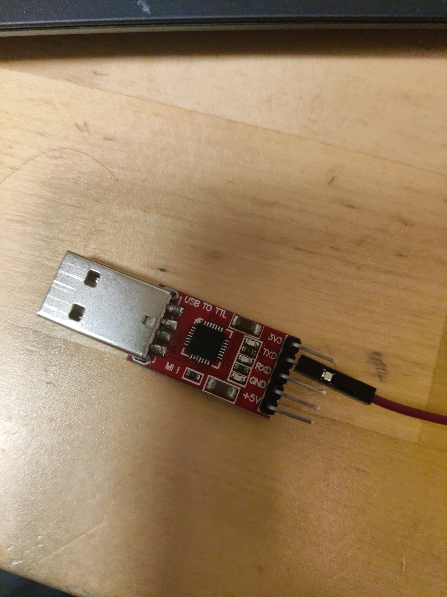
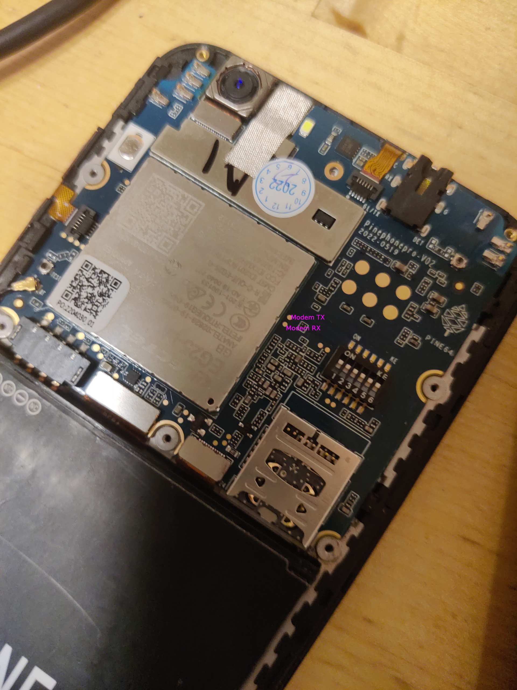

# Really really emergency recovery with Quectel's Fastboot bootloader

## When you'd need this

* [X] Your Quectel modem stopped booting
* [X] You were running stock
* [X] You didn't have the custom bootloader installed
* [X] You don't have access to the QDL pins because you're running a PinePhone Pro with the RF shield on top of the modem

## Things you need

- 1x USB Cable to connect the Pinephone Pro
- 1x USB TTL Serial adapter (1.8v)
- 1x Jumper / breadboard cable
- 1x USB Hub, or have access to 2 usb ports in the same computer
- 1x Set of screwdrivers
- Preferred: USB ssh access to the phone, since you're going to loose the wifi antennas as soon as you remove the middle frame.
- A copy of the latest Modem Distro firmware
- A lot of patience

## Background

Quectel's stock bootloader is... poorly made. To help with recovery, they sort of attempted to add some countdown timer where you can press CTRL+C during boot, but in practice, that timer goes down to 0 in less than half a second, because it's just a for loop counting from 10 to 0, literally:
```
for (i = 10; i != 0; --i)
	{
		if (!getc(&ch) && ch == 0x03)
		{
			printf("PINTEST: test gpio(s) connectivity.\n");
			printf("fastboot: set fastboot mode.\n");
#ifndef QUECTEL_FLASH_SUPPORT_1G
			printf("recovery: set recovery mode.\n");
#endif
			while(1)
			{
				ch = uart_getc(0, 1);
				putc(ch);

				if((ch >= 'A' && ch <= 'Z')
				 ||(ch >= 'a' && ch <= 'z')
				 || ch == 0x0d)
				{
					if(ch == 0x0d)
					{
						if(strlen("PINTEST") == cmd_buffer_cnt
							&& !memcmp(cmd_buffer, "PINTEST", cmd_buffer_cnt))
						{
							printf("PIN TEST MODE\r\n", __func__);
							gpio_test_mode();
							goto exit_pintest_mode;
						}
						else if(strlen("fastboot") == cmd_buffer_cnt
							&& !memcmp(cmd_buffer, "fastboot", cmd_buffer_cnt))
						{
							printf("%s: going to fastboot mode.\n", __func__);
							goto fastboot;
						}
```
What this means is you need to be fast triggering it or it won't work.


## Preparations (phone)

1. Make sure you have SSH access to the phone. If possible, use SSH over USB since your wifi may stop working as soon as you remove the middle frame
2. Remove the phone's middle frame
3. With the middle frame removed, connect the battery and plug the phone's USB port to the computer
4. Turn off the modem kill switch
5. Once it has booted, make sure both `ModemManager` and `eg25-manager` are stopped (`systemctl stop ModemManager ; systemctl stop eg25-manager`)
6. Unpack the latest custom firmware to a folder and have a shell opened there

## Preparations (computer)

1. Open a *root* terminal
2. Connect the USB Serial adapter to another USB port in your computer. It's important that you connect both phone and usb uart either to the same hub, or to direct ports in the computer, so you are sure they're sharing the same ground without interference (that way you don't have to connect the ground pin on the serial port, so you only need to use one wire)
3. Connect your jumper wire on the TX pin on the USB UART:
4. 
5. Copy this into a script (more on that later), let's call it for example `serialcmd.sh`:

```
#!/bin/sh
echo "\003cmd\r" > /dev/ttyUSB0
```
NOTE: MAKE SURE YOUR SERIAL PORT NUMBER MATCHES YOUR USB UART DEVICE (ttyUSB0, 1...)
6. In a shell, run `chmod +x serialcmd.sh`

## Getting it done

### Computer

We're going to spam the serial port with a CTRL+C cmd [ENTER] message with the script we did. That will make the modem enter fastboot mode if it catches it. So, on that root terminal we got ready, we'll simply run `watch -n0.1 ./serialcmd.sh`. This will make the computer send the ctrl+c command every 100ms, which should be enough.

You should see the USB UART leds blinking all the time, that's normal.

Now we jump to the SSH shell on the phone and work from there

### Phone

1. Turn the Modem kill switch on
2. Open 2 root SSH sessions to the phone
3. On the first ssh session, run `dmesg -w` so you can see the kernel logs in real time
4. On the second ssh session, type in `systemctl start eg25-manager` but don't hit enter yet
5. Carefully place the TX wire you left plugged to the USB Uart adapter and connect it to the Modem's RX debug pin in the Pinephone Pro:



6. Actually run the `systemctl start eg25-manager` command to trigger a modem power up

## Did it work?
If it worked, the terminal with `dmesg` running will show you a fastboot device. Congratulations, you're in! Remove the USB uart cable, and run `flashstock` from the custom firmware to have a functional bootloader where you can simply run `fastboot oem stay` to force it to fastboot mode.
If it doesn't boot all the way into the distro for some reason, remember you can run:
1. `fastboot oem stay &` (to leave fastboot running in the background)
2. Kill switch off and then on again to the modem
3. `systemctl restart eg25-manager`

And this will land you in fastboot mode where you can flash another ADSP firmware, wipe user data etc.

## It didn't work?
1. Turn the modem kill-switch off and on again
2. Stop eg25-manager
3. Place the cable carefully onto the debug pin again
4. Go back to the phone part's step 4


If you have good soldering skills, you can have solder both RX and TX to the board and it will make it a lot easier